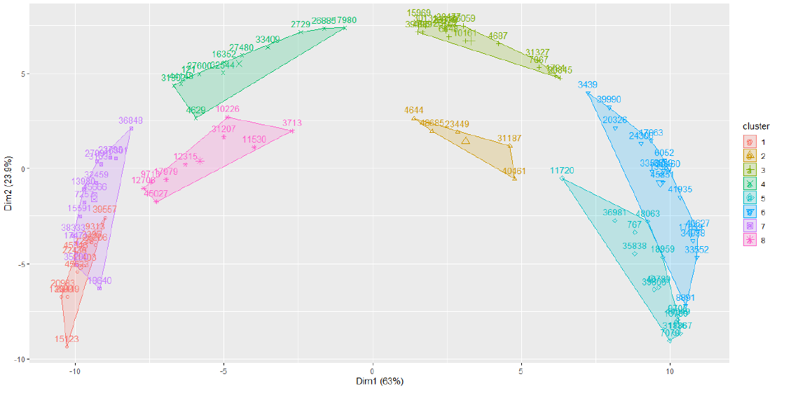
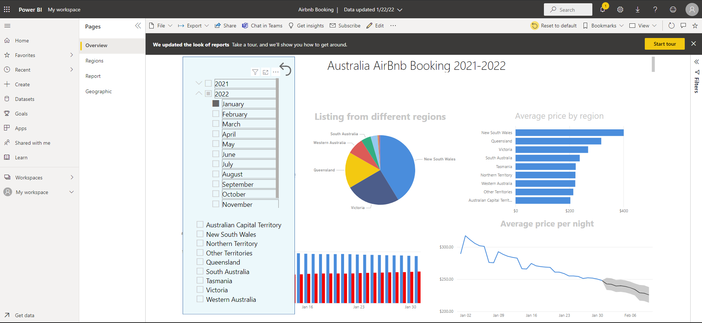
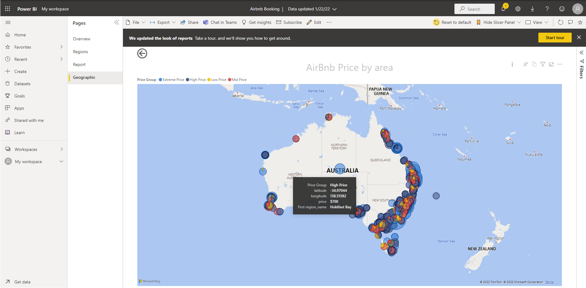

# Joe Kwan Portfolio
Some work from Master of Data Science and my leisure time.

# [Project 1 - AirBnb Data Analysis](AirBnb Data Analysis Project.pdf)

## Overview
To analyze Airbnb data from 2019 to 2020, investigate which factors affect the price and the booking schedule. Also, generating a prediction model to suggest what facility and which location can help boost up the price and booking inquiries.

  
  **
Click for more detail
**

## Task
- Use R to do data cleaning and manipulation, clustering, and correlation test to isolate necessary feature.
- Use NLP and SVM to build a regression model, identify what feature affects the renting price, and build a prediction model.
- Use Tableau and R markdown for reporting.

## Notes
As the only one in the team who has 10 years of coding experience, I handle a bit more coding than others.
The whole team design what features we need for analysis/prediction, and I help with coding. 
Each of us involved all the K-mean clustering, Regression model, analysis, and visualization. 
I work a bit more on NLP/SVM.

## Preview

  
## Data Engineering
Using the same Airbnb dataset, applied a basic data pipeline using AWS glue/athena/quicksight.  
Generated a simple visual similar as PowerBI dashboard below. 
This is to demonstrate my skills of working on cloud data ETL tools. 
Didn't choose Redis/Snowflake because this data is in a relatively simple structure and small volume. 

Pipeline flow: 
S3(CSV) > Glue Crawler(Data/Column transformation) > S3(parquet) > Glue Job <> Glue DataBrew(Data Preparation and Scheme update) > Athena > Quicksight

  
<a href="https://ap-southeast-1.quicksight.aws.amazon.com/sn/accounts/031268667119/dashboards/327300b3-61bb-48eb-b2b8-83ceb2dc4e79" target="_blank"> > Airbnb QuickSight Dashboard</a>
  
***Below are the temporary Quicksight account setup for viewing the dashboard.
  
Quicksight Accout: airbnb-quicksight-demo
 
Email: byzjoe@gmail.com
 
Password: QQwe@123

  

 
  

## Power BI Visual
A simple visual only to demonstrate my PowerBI skills, not as fancy as in the report.
Quick EDA of the AirBnb data.

<a href="https://drive.google.com/file/d/1o4JyFWo128lpGd-4jVszbJQN6Owd8KI3/view?usp=sharing" target="_blank"> > PowerBI: AirBnb EDA</a>

 

 
  

# [Project 2 - Creativity Assessment Automation](Creativity Assessment Automation.pdf)

## Overview
This project is to help our client to evaluate people’s creativity levels. Since our client doesn’t have a systematic method to do that, our goal is to develop an AI model that can base on an image, and the text response of that image from test subjects to evaluate their creativity level.

  
Click for more detail

  
  
## Task
- Use GCP Vision to analyze images and identify necessary information.
- Use R, NLP to analyze images and text data for establishing data features to train prediction models.
- Use Bayesian Network to build DAG for understanding cause and effect and the probabilities of data features.
- Build prediction model using Bayesian Network.
- Use Tableau and R markdown for reporting.

## Notes
There are only 2 people with coding experience including me in this team, hence we handle most of the heavy coding tasks.
The other coder handles research of neural networks and provides some help for other teammates.
I mainly develop API for image analysis and also decide features using Bayesian network. 
In the end, I come up with various valuable features using Bayesian network and create a useful prediction model which brings a HD to the team. 

## Preview

## Code
- [R - Bayesian Network Analysis.Rmd](code/R - Bayesian Network Analysis.Rmd)
- [Python - image_analysis.py](code/Python - image_analysis.py)
- [Python - calculate_similarity.py](code/Python - calculate_similarity.py)
  

